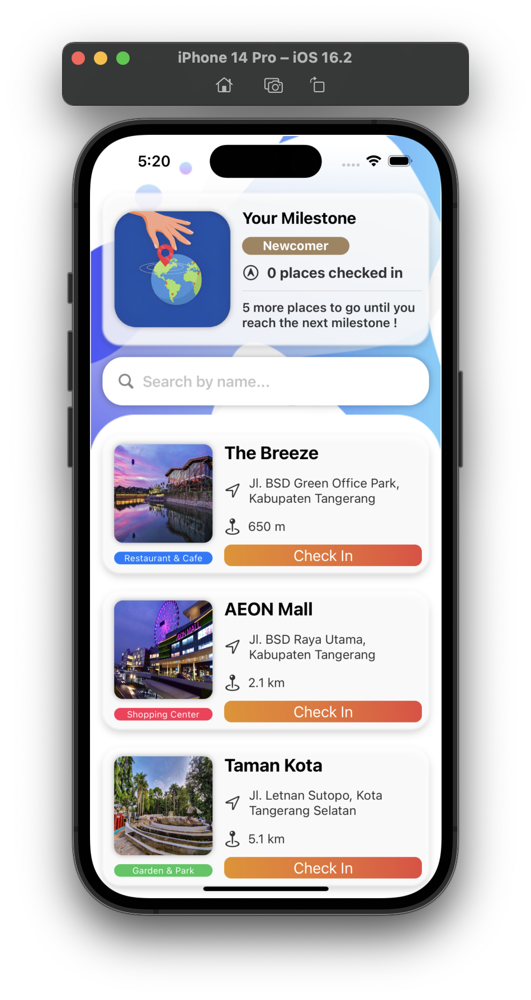
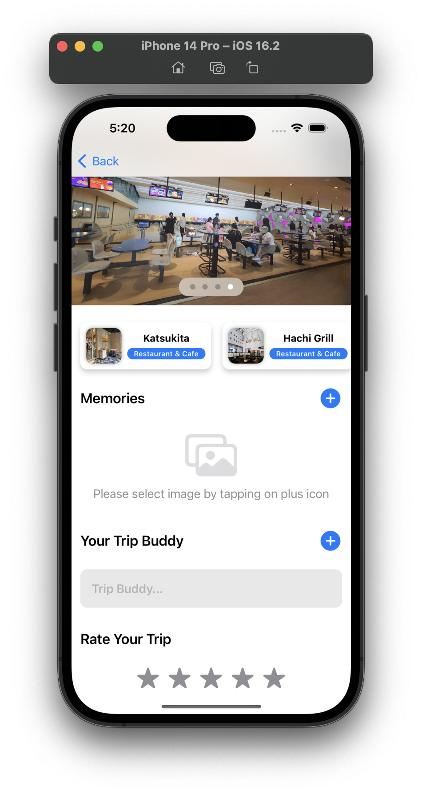

<!-- ABOUT THE PROJECT -->
<p align="center">
  <a href="#" target="_blank"></a>
</p>

# TripPal
Aplikasi TripPal adalah Aplikasi iOS . Klik hyperlink ini untuk melihat [Prototype Sketch](https://sketch.com/s/bec7193a-0455-44dd-a4eb-3b3406871c37).

### Preview
<p align="center">
  <a href="#" target="_blank"></a>
  <a href="#" target="_blank"></a>
  <a href="#" target="_blank"></a>
</p>

<!-- ABOUT THE FILE & FOLDER STRUCTURE -->
## Folder & File Structure
Berikut struktur file dan folder pada TripPal:

    .
    ├── TripPals.swift          # Root Project: Konfigurasi ContentView
    ├── Info.plist              # Fonts Provided by Aplication: Poppins-(Regular, Medium, SemiBold, dan Bold)
    ├── ContentView.swift       # Tampilan Home Page
    ├── Assets                  # Aset Logo & Gambar
    ├── DetailPageView.swift    # Tampilan Detail Page
    ├── HomeView.swift          # Berisikan Halaman Home / Beranda (Frontend Only)
    ├── GyozaDetailView.swift   # Berisikan Halaman Gyoza Food Detail (Frontend Only)
    ├── OrangeDetailView.swift  # Berisikan Halaman Orange Food Detail (Frontend Only)
    ├── AvocadoDetailView.swift # Berisikan Halaman Avocado Food Detail (Frontend Only)
    └── OrderView.swift         # Berisikan Halaman Order (Frontend Only)

<!-- List of Features -->
## Features:

* Reusable Components
* Photo Picker with PhotoUI (Upload Images)
* Grid Layout (Horizontal)
* All Stacks (HStack, VStack, ZStack)
* All ScrollView (Horizontal & Vertical)
* Rating with Mask
* Slideshow with TabView
* Search Bar
* Basic Navigations with Navigation Link
* Declarative UI with @State & @Binding
* Importation Assets from Sketch for Image Assets

<!-- Used Tools -->
## Build With:

* [Swift](https://www.swift.org/documentation/)
* [SwiftUI](https://developer.apple.com/documentation/swiftui/)
* [Xcode](https://developer.apple.com/xcode/)
* [Sketch](https://sketch.com/s/bec7193a-0455-44dd-a4eb-3b3406871c37)

<!-- How to Install -->
## Installation
Untuk menggunakan repositori ini, ikutilah petunjuk penggunaan berikut dan pastikan git sudah terinstall pada komputer (semua perintah dilaksanakan pada `cmd.exe` atau `terminal`):

1. Lakukan download .zip atau `clone` repositori dengan cara:
```bash
git clone https://github.com/theresatiffanytan/TripPal.git
```

2. Jika sudah Download / Clone Project silahkan buka Project di Xcode dengan Klik Open a Project or File.
3. Pastikan untuk memilih iPhone pada Target Simulator (Kolom Device dibagian atas Xcode). 
4. Build & Run

Anggota Kelompok 22 (Nano Challenge 1) Apple Academy Indonesia Cohort 6 yang berkontribusi dalam pengerjaan proyek terdiri dari :
* [Theresa Tiffany](https://github.com/anfrhana)
* [Deka Primatio Deandra](https://www.github.com/dekapd99)
* [Gery](https://github.com/B0ndan)

<!-- What Kind of License? -->
## License
MIT License: Copyright (c) 2022 


<p align="right">(<a href="#top">back to top</a>)</p>
